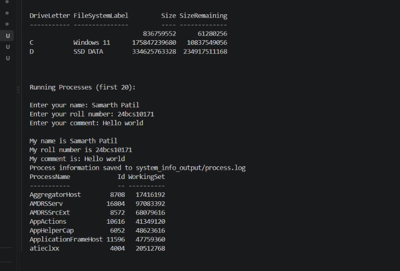

# Shell Scripting — Homework

**Name:** Aditya Vikram Singh
**Roll No.:** 24bcs10429

## Task: System Information Script

### Overview

A shell script (`system_info.sh`) was written that prints system information, takes user input, and stores running process information in a log file.

### Commands / Concepts Used

- `mkdir -p`
- `touch`
- `echo`
- `date`
- `hostname`
- `whoami`
- `df`
- `ps`
- `read -p`
- Variables
- `>` and `>>` output redirection

### Features Implemented

- Prints the current date, hostname, and username.
- Displays disk usage (`df`) and running processes (`ps`).
- Creates a `system_info_output` directory using `mkdir -p`.
- Creates a `process.log` file using `touch`.
- Stores running-process information in `process.log` using `>` redirection.
- Takes user input (name, roll number, comment) using `read -p`.
- Appends the entered user details to the log file using `>>` redirection.

### Script (`system_info.sh`)

```bash
# Create directory
mkdir -p system_info_output
cd system_info_output

# Create file using touch
touch process.log

# Store data in variables
current_date=$(date)
current_hostname=$(hostname)
current_user=$(whoami)

# Print current date
echo "Current Date: $current_date"

# Print hostname and username
echo "Hostname: $current_hostname"
echo "Username: $current_user"
who
w

# Print disk usage
echo "Disk Usage:"
df

# Print running processes
ps

# Save process info inside process.log
ps > process.log

# Take input using read -p
read -p "Enter your name: " name
read -p "Enter your roll number: " roll_no
read -p "Enter your comment: " comment

# Print the entered details
echo "My name is $name"
echo "My roll number is $roll_no"
echo "My comment is: $comment"

# Also append name, roll no, comment to process.log
echo "My name is $name" >> process.log
echo "My roll number is $roll_no" >> process.log
echo "My comment is: $comment" >> process.log

echo "Process information saved to system_info_output/process.log"
```

### How to Run

```bash
chmod +x system_info.sh
./system_info.sh
```

### Output Files

```text
system_info_output/
└── process.log
```

### Sample Output

```text
Current Date: Mon Aug 31 20:00:00 IST 2026
Hostname: ubuntu
Username: aditya

Disk Usage:
...

My name is Aditya
My roll number is 24BCS10429
My comment is: Shell scripting completed

Process information saved to system_info_output/process.log
```

### Screenshot — Script Execution / Output



## Images


---

