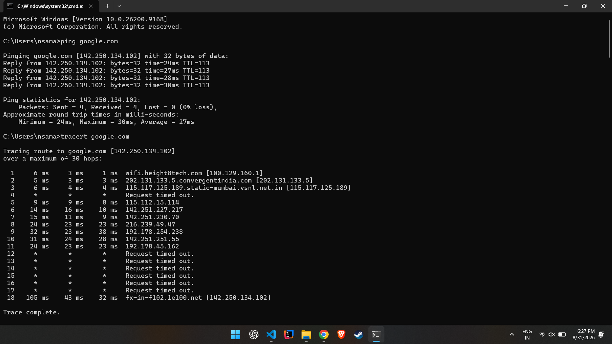
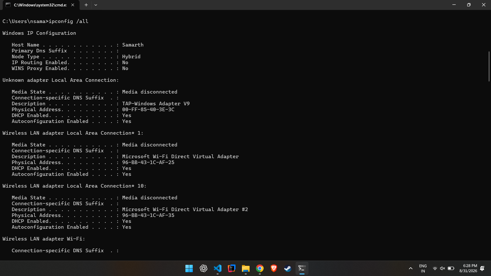
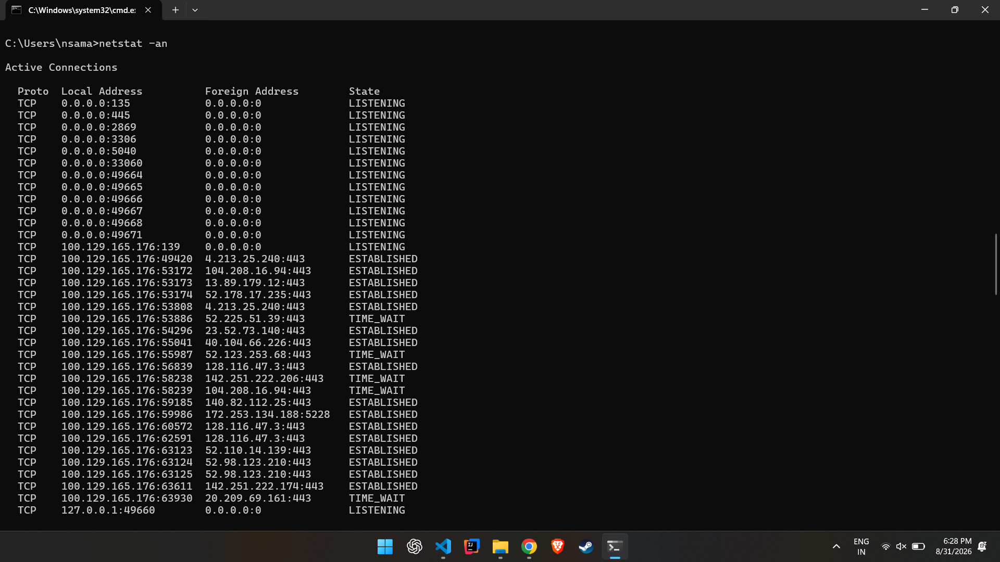
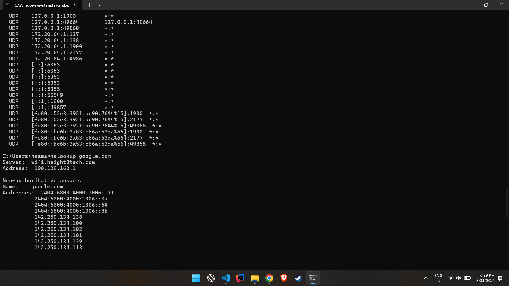

# Networking Fundamentals — Homework

**Name:** Aditya Vikram Singh
**Roll No.:** 24bcs10429

## Task 1

Commands and the repo shared in the devops-hero GitHub repo were practiced locally.

## Task 2 — Networking Commands, Output & Explanation

### 1. `ping`

```
Pinging google.com [142.250.134.102] with 32 bytes of data:
Reply from 142.250.134.102: bytes=32 time=24ms TTL=113
Reply from 142.250.134.102: bytes=32 time=27ms TTL=113
Reply from 142.250.134.102: bytes=32 time=28ms TTL=113
Reply from 142.250.134.102: bytes=32 time=30ms TTL=113

Ping statistics for 142.250.134.102:
    Packets: Sent = 4, Received = 4, Lost = 0 (0% loss),
Approximate round trip times in milli-seconds:
    Minimum = 24ms, Maximum = 30ms, Average = 27ms
```

**Understanding:** `ping` sends ICMP echo-request packets to a target host and waits for echo-reply packets. It confirms whether a host is reachable and reports round-trip latency and packet loss — useful for basic connectivity checks.

---

### 2. `tracert` (traceroute)

```
Tracing route to google.com [142.250.134.102]
over a maximum of 30 hops:

  1     6 ms     3 ms     1 ms  wifi.height8tech.com [100.129.160.1]
  2     5 ms     3 ms     3 ms  202.131.133.5.convergentindia.com [202.131.133.5]
  3     6 ms     4 ms     4 ms  115.117.125.189.static-mumbai.vsnl.net.in [115.117.125.189]
  4     *        *        *     Request timed out.
  5     9 ms     9 ms     8 ms  115.112.15.114
  6    14 ms    16 ms    10 ms  142.251.227.217
  7    15 ms    11 ms     9 ms  142.251.230.70
  8    24 ms    23 ms    23 ms  216.239.49.47
  9    32 ms    23 ms    38 ms  192.178.254.238
 10    31 ms    24 ms    28 ms  142.251.251.55
 11    24 ms    23 ms    23 ms  192.178.45.162
 12     *        *        *     Request timed out.
 13     *        *        *     Request timed out.
 14     *        *        *     Request timed out.
 15     *        *        *     Request timed out.
 16     *        *        *     Request timed out.
 17     *        *        *     Request timed out.
 18   105 ms    43 ms    32 ms  fx-in-f102.1e100.net [142.250.134.102]

Trace complete.
```



**Understanding:** `tracert`/`traceroute` shows the sequence of routers (hops) a packet passes through to reach the destination, along with the round-trip time at each hop. Hops that show `*` timed out (often due to routers not responding to ICMP), which is normal and doesn't necessarily indicate a network problem.

---

### 3. Checksum (`CertUtil`)

```
C:\Users\nsama\testfile.txt:
9f86d081884c7d659a2feaa0c55ad015a3bf4f1b2b0b822cd15d6c15b0f00a08

CertUtil: -hashfile command completed successfully.
```

**Understanding:** `certutil -hashfile` computes a cryptographic hash (checksum) of a file. Checksums are used to verify file integrity — if a file's hash matches a known-good value, the file has not been corrupted or tampered with.

---

### 4. `ipconfig /all`

```
Windows IP Configuration

   Host Name . . . . . . . . . . . . : Samarth
   Primary Dns Suffix  . . . . . . . :
   Node Type . . . . . . . . . . . . : Hybrid
   IP Routing Enabled. . . . . . . . : No
   WINS Proxy Enabled. . . . . . . . : No

Wireless LAN adapter Wi-Fi:

   Connection-specific DNS Suffix  . :
   Description . . . . . . . . . . . : MediaTek MT7921 Wi-Fi 6 802.11ax PCIe Adapter
   Physical Address. . . . . . . . . : 94-BB-43-1C-AF-25
   DHCP Enabled. . . . . . . . . . . : Yes
   Autoconfiguration Enabled . . . . : Yes
   Link-local IPv6 Address . . . . . : fe80::52e3:3921:bc90:7644%15(Preferred)
   IPv4 Address. . . . . . . . . . . : 100.129.165.176(Preferred)
   Subnet Mask . . . . . . . . . . . : 255.255.240.0
   Default Gateway . . . . . . . . . : 100.129.160.1
   DHCP Server . . . . . . . . . . . : 100.129.160.1
   DNS Servers . . . . . . . . . . . : 100.129.160.1
                                       8.8.8.8
```
*(full adapter listing captured in the screenshot below)*



**Understanding:** `ipconfig /all` displays detailed network configuration for every adapter on the machine — IP address, subnet mask, default gateway, DHCP/DNS servers, and MAC (physical) address. It's the go-to command for diagnosing local network configuration issues.

---

### 5. `netstat`

```
Active Connections

  Proto  Local Address          Foreign Address        State
  TCP    0.0.0.0:135            0.0.0.0:0              LISTENING
  TCP    0.0.0.0:445            0.0.0.0:0              LISTENING
  TCP    0.0.0.0:3306           0.0.0.0:0              LISTENING
  TCP    100.129.165.176:49420  4.213.25.240:443       ESTABLISHED
  TCP    100.129.165.176:53886  52.225.51.39:443       TIME_WAIT
  ...
```
*(full connection table captured in the screenshot below)*



**Understanding:** `netstat` lists active TCP/UDP connections and listening ports on the machine, along with their state (`LISTENING`, `ESTABLISHED`, `TIME_WAIT`, etc.). It's useful for seeing which services are listening on which ports and which remote hosts the machine is currently talking to.

---

### 6. `nslookup`

```
Server:  wifi.height8tech.com
Address:  100.129.160.1

Non-authoritative answer:
Name:    google.com
Addresses:  2404:6800:4000:1006::71
          2404:6800:4000:1006::8a
          2404:6800:4000:1006::64
          2404:6800:4000:1006::8b
          142.250.134.138
          142.250.134.100
          142.250.134.102
          142.250.134.101
          142.250.134.139
          142.250.134.113
```



**Understanding:** `nslookup` queries the DNS server to resolve a domain name to its IP address(es) (both IPv4 and IPv6). It also shows which DNS server answered the query, which is useful for diagnosing DNS resolution issues.

---


