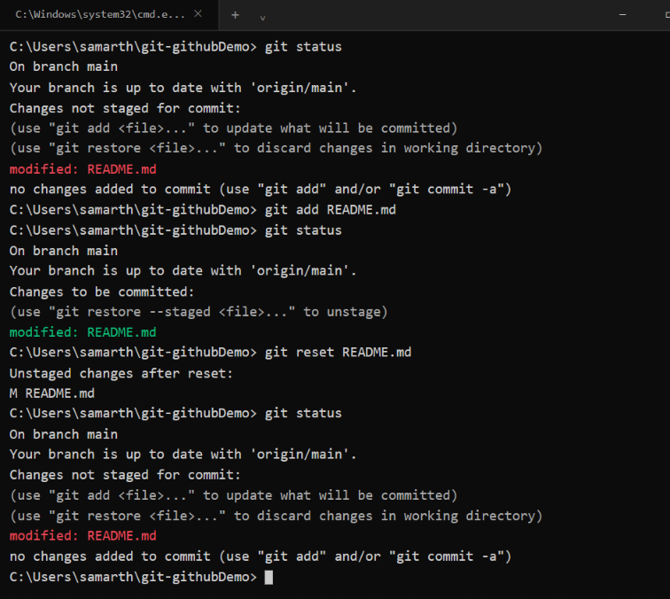

# Git / GitHub — Homework

**Name:** Aditya Vikram Singh
**Roll No.:** 24bcs10429

## Overview

This homework focused on Git staging, committing, and selectively applying commits across branches. It covers:

1. `git reset <file>`
2. `git commit -a -m` vs `git commit -m`
3. `git cherry-pick`

---

## 1. `git reset <file>` (understanding staging)

### Objective

Understand how `git reset README.md` affects a file that has already been staged.

### Commands Tested

The `README.md` file was modified and checked:
```bash
git status
```
It appeared under:
```text
Changes not staged for commit:
    modified: README.md
```

The file was staged:
```bash
git add README.md
```
`git status` now showed:
```text
Changes to be committed:
    modified: README.md
```

Reset was then tested:
```bash
git reset README.md
```

### Result

After `git reset README.md`, the file moved back from **"Changes to be committed"** to **"Changes not staged for commit."** The edits inside `README.md` were **not deleted** — only the staging state changed.

```text
Modified File
     │
     ▼
  git add
     │
     ▼
   Staged
     │
     ▼
git reset README.md
     │
     ▼
  Unstaged
```

> **`git reset README.md` removes the file from the staging area but keeps the changes in the working directory.**

### Screenshot — Git Reset Test



---

## 2. `git commit -a -m` vs `git commit -m`

### Objective

Understand the difference between the regular `git commit -m` command and `git commit -a -m`.

### Regular `git commit -m`

Requires changes to be staged before committing:
```bash
git add README.md
git commit -m "Update README"
```
It commits whatever is already in the staging area.

### `git commit -a -m`

The `-a` flag automatically stages **modified and deleted files that are already tracked by Git**, then commits them — skipping the manual `git add` step for those files.
```bash
git commit -a -m "Update README"
```

### Comparison

| `git commit -m` | `git commit -a -m` |
|---|---|
| Commits already-staged changes | Auto-stages modified/deleted *tracked* files, then commits |
| Requires `git add` first for unstaged modifications | Skips `git add` for tracked-file modifications |
| Does not include untracked files | Does not include untracked files either |
| Gives explicit control over what is staged | Convenient for quick commits of tracked files |

### Important Note

`-a` does **not** add brand-new untracked files. For a new file `newfile.txt` that Git has never tracked:
```bash
git commit -a -m "Add new file"
```
will not include it — it must first be added explicitly:
```bash
git add newfile.txt
```

---

## 3. Git Cherry-Pick

### Objective

Understand how a specific commit from another branch can be applied to the current branch without merging the entire branch.

### Workflow Used

1. Created 2–4 commits on `main`.
2. Viewed history with `git log`.
3. Created a new branch and made 2–3 more commits on it.
4. Identified a specific commit using `git log`.
5. Cherry-picked that one commit back onto `main`.
6. Verified the change was present on `main`.

```text
main
 │
 ├── Commit A
 ├── Commit B
 └── Commit C
        │
        └── create new branch
              │
              ├── Commit D
              ├── Commit E
              └── Commit F
```

Cherry-picking a single commit onto `main`:
```bash
git cherry-pick <commit-hash>
```

Result (conceptually):
```text
main
 │
 ├── Commit A
 ├── Commit B
 ├── Commit C
 └── Commit D'
```
`Commit D'` carries the same changes as the picked commit but is a new commit object on `main`.

### Commands Used

View history:
```bash
git log --oneline
```
Create a new branch:
```bash
git checkout -b feature
```
Return to main:
```bash
git checkout main
```
Apply a specific commit:
```bash
git cherry-pick <commit-hash>
```
Verify:
```bash
git log --oneline --graph --all
```

### Why Cherry-Pick Is Useful

Cherry-picking lets you pull in *one* useful commit from a branch (e.g. `Commit E` out of `D, E, F`) without merging the rest of that branch's history into `main`.

---

## Key Takeaways

- `git reset <file>` unstages a file without discarding its changes.
- `git commit -m` commits what's already staged.
- `git commit -a -m` auto-stages modifications/deletions to already-tracked files before committing — but never new untracked files.
- `git cherry-pick <hash>` applies one specific commit onto the current branch.
- `git log --oneline --graph --all` is useful for visualizing branch/commit history.

---
