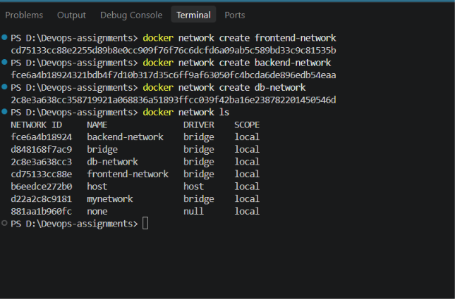
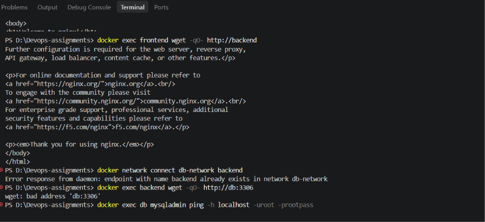
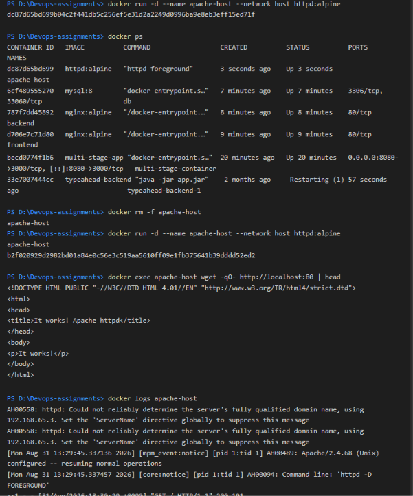
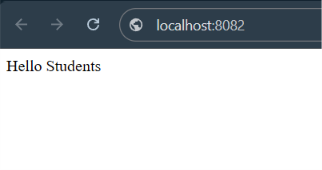

# Docker Networking & Volumes — Homework

**Name:** Aditya Vikram Singh
**Roll No.:** 24bcs10429

## Objective

Understand Docker networking and volumes through hands-on exercises:

- Creating custom Docker bridge networks
- Connecting containers to different networks
- Testing container-to-container connectivity
- Using host networking
- Performing a bind mount
- Understanding overlay networks and their use cases

---

## 1. Creating Docker Networks

Three custom Docker bridge networks were created:
```bash
docker network create frontend-net
docker network create backend-net
docker network create db-net
```

Checked with:
```bash
docker network ls
```
The three custom networks were successfully created with the `bridge` driver.

### Screenshot


## Images


---

## 2. Frontend, Backend, and Database Containers

### Frontend Container
An Nginx Alpine container was created on the frontend network:
```bash
docker run -d --name frontend --network frontend-net nginx:alpine
```

### Backend Container
Another Nginx Alpine container was created on the backend network:
```bash
docker run -d --name backend --network backend-net nginx:alpine
```
It was then connected to the frontend network:
```bash
docker network connect frontend-net backend
```
and later also to the database network:
```bash
docker network connect db-net backend
```
So the backend container ended up connected to **three** networks: `frontend-net`, `backend-net`, and `db-net` — demonstrating how one container can join multiple networks to communicate with different groups of containers.

### Database Container
A MySQL 8 container was created on the database network:
```bash
docker run -d \
  --name db \
  --network db-net \
  -e MYSQL_ROOT_PASSWORD=rootpass \
  mysql:8
```

---

## 3. Container Connectivity

### Frontend → Backend
```bash
docker exec frontend wget -qO- http://backend
```
This returned the default Nginx HTML page, confirming the frontend container could resolve `backend` by Docker network name and reach it.

### Backend → Database
Initially, the backend was not on `db-net`, so the `db` hostname could not be resolved. After connecting:
```bash
docker network connect db-net backend
```
```bash
docker exec backend wget -qO- http://db:3306
```
returned:
```text
wget: bad header line: 8.4.9
```
This is expected — MySQL speaks the MySQL protocol, not HTTP — but it confirms the `db` hostname resolved and the backend reached the MySQL service.

MySQL itself was verified with:
```bash
docker exec db mysqladmin ping -h localhost -uroot -prootpass
```
Result:
```text
mysqld is alive
```

### Screenshot


## Images


---

## 4. Apache Using the Host Network

```bash
docker pull httpd:alpine
docker run -d --name apache-host --network host httpd:alpine
docker ps
```
Verified from inside the container:
```bash
docker exec apache-host wget -qO- http://localhost:80 | head
```
Returned:
```text
<title>It works! Apache httpd</title>
```
Container logs confirmed Apache was running and returned HTTP `200`.

**Note:** On this Docker Desktop environment, accessing the host-networked container directly through `http://localhost:80` from the browser wasn't available, so the internal `wget` request and container logs were used as evidence that Apache was serving correctly.

### Screenshot


## Images


---

## 5. Bind Mount

A local directory was set up:
```bash
mkdir -p docker-networking/bind-mount
cd docker-networking/bind-mount
```
An `index.html` file was created with the content:
```text
Hello students
```
Nginx was started with the current directory bind-mounted to the web root:
```bash
docker run -d --name bind-nginx -p 8082:80 \
  -v "$(pwd):/usr/share/nginx/html" \
  nginx:alpine
```
Accessed at `http://localhost:8082` — the browser showed `Hello students`.

### Before Modification


## Images


### Modifying the Mounted File

The local `index.html` was changed to:
```text
I am Aditya Vikram Singh
```
The browser was refreshed **without restarting** the container, and the updated content appeared immediately — demonstrating that host-file changes are reflected live inside the container via the bind mount.

### After Modification


## Images


---

## 6. Understanding Overlay Networks

An overlay network is a Docker network that lets containers running on **different Docker hosts** communicate with each other — unlike a bridge network, which is generally limited to a single host.

### Use Cases
- Docker Swarm services
- Multi-host container communication
- Distributed applications
- Microservice architectures
- Any scenario where containers on different hosts need to talk to each other

```text
Docker Host 1                  Docker Host 2
┌──────────────┐              ┌──────────────┐
│ Container A  │              │ Container B  │
└──────┬───────┘              └──────┬───────┘
       │                              │
       └──────── Overlay Network ─────┘
```

The overlay network provides a virtual network spanning the Docker hosts, so containers can communicate as if they were on the same logical network.

---

## 7. Important Commands

| Command | Purpose |
|---|---|
| `docker network create` | Creates a Docker network |
| `docker network ls` | Lists Docker networks |
| `docker network connect` | Connects a container to another network |
| `docker network inspect` | Displays detailed network information |
| `docker run --network` | Starts a container on a specified network |
| `docker exec` | Executes a command inside a running container |
| `docker pull` | Downloads an image from Docker Hub |
| `docker ps` | Lists running containers |
| `--network host` | Uses the host network for a container |
| `-v` | Creates a bind mount |
| `wget` | Tests HTTP connectivity |
| `mysqladmin ping` | Checks whether MySQL is running |

---

## 8. Key Learnings

1. Docker containers can communicate using Docker network names.
2. Custom bridge networks provide isolated communication between containers.
3. A single container can be connected to multiple networks at once.
4. Containers on the same network resolve each other by container name.
5. Host networking removes normal container network isolation.
6. Bind mounts share host files directly with a container.
7. Bind-mounted file changes are reflected without restarting the container.
8. Overlay networks enable communication between containers on different Docker hosts.

---

## Conclusion

This exercise provided hands-on experience with Docker networking and volumes — creating multiple custom networks, connecting frontend, backend, and database containers, testing connectivity, using host networking with Apache, and performing a bind mount with Nginx. It demonstrated how Docker provides networking isolation, container discovery, multi-network connectivity, and live access to host files through bind mounts.

---
