# Session 14 — Kubernetes Troubleshooting


A hands-on Kubernetes troubleshooting session covering `kubectl get`, `describe`, `logs`, `exec`, `cp`, Events, `CrashLoopBackOff`, `ImagePullBackOff`, Pending Pods, Service/DNS troubleshooting, Service endpoints, and a troubleshooting mini-project.

> **Image paths:** Every screenshot in this README uses a repository-relative path such as `./images/<filename>`. No machine-specific absolute paths are used, so the README works after cloning or moving the project.
> **Screenshot personalization:** Terminal prompt usernames/hostnames in the screenshots have been updated to `Aditya@Adityas-MacBook-Air`.

---

## Session Structure

```text
01-kubectl-get
02-kubectl-describe
03-kubectl-logs
04-kubectl-exec
05-events
06-crashloopbackoff
07-imagepullbackoff
08-pending-pods
09-service-dns-troubleshooting
mini-project
```

## Execution Verification

The session included multiple Kubernetes workloads running in Minikube. The overall Pod verification also captured an intentionally failing `dns-test` workload in `ImagePullBackOff`, which was useful for the troubleshooting exercises.

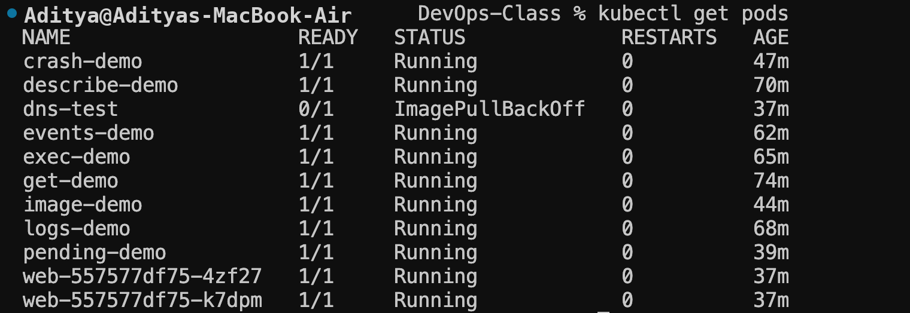

---

# 1. `kubectl get`

`kubectl get` provides a quick view of Kubernetes resources and their current state.

### Commands

```bash
kubectl get pods
kubectl get pod get-demo
kubectl get pods -o wide
kubectl get pods -w
```

The `-w` / `--watch` option continuously watches for resource changes.

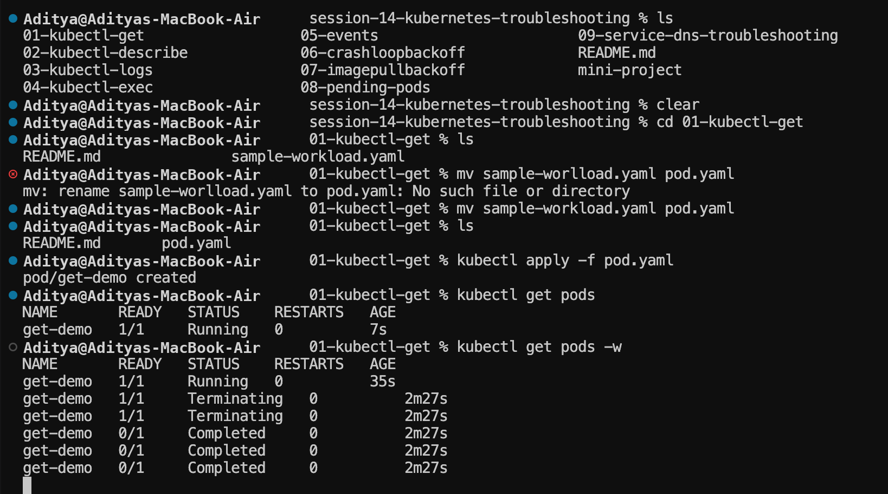

---

# 2. `kubectl describe`

`kubectl describe` provides detailed information about a Kubernetes resource, including metadata, labels, node assignment, containers, images, conditions, volumes, and related Events.

### Command

```bash
kubectl describe pod get-demo
```

It is particularly useful when a Pod is not starting, repeatedly crashes, cannot pull an image, or has unexpected scheduling/networking behavior.

---

# 3. `kubectl logs`

`kubectl logs` displays output produced by a container.

```bash
kubectl logs image-demo
kubectl logs pod/image-demo
kubectl logs <pod-name> -c <container-name>
```

Logs can reveal application messages, startup information, runtime errors, configuration problems, and application crashes.

For the `crash-demo` exercise, the output included:

```text
Application starting...
Something went wrong!
```

This showed that the container command was exiting with a failure.

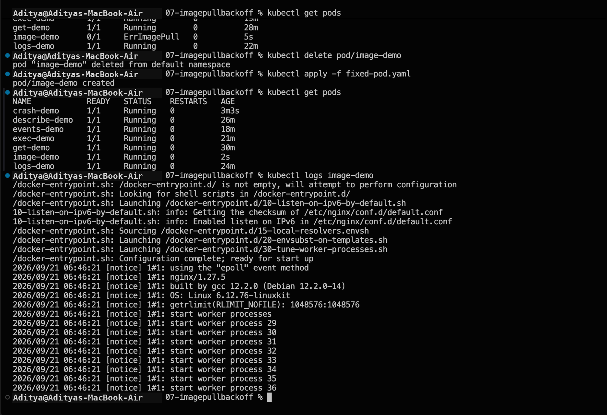

---

# 4. `kubectl exec`

`kubectl exec` runs a command inside a running container.

```bash
kubectl exec -it exec-demo -- ls
```

The `--` separates kubectl arguments from the command executed inside the container.

For an interactive shell:

```bash
kubectl exec -it exec-demo -- sh
```

Common options:

```text
-i  Keep standard input open
-t  Allocate a terminal
```

---

# 5. `kubectl cp`

`kubectl cp` copies files between a local machine and a container.

### Pod → local machine

```bash
kubectl cp exec-demo:/docker-entrypoint.sh ./docker-entrypoint.sh
```

### Local machine → Pod

```bash
kubectl cp ./docker-entrypoint.sh exec-demo:/tmp/docker-entrypoint.sh
```

General syntax:

```bash
kubectl cp <pod-name>:<path-inside-pod> <local-path>
kubectl cp <local-path> <pod-name>:<path-inside-pod>
```

---

# 6. Kubernetes Events

Kubernetes Events record important resource activity such as scheduling, image pulling, container creation, startup, termination, and warnings.

### Commands

```bash
kubectl events
kubectl get events
```

Typical fields include:

```text
LAST SEEN
TYPE
REASON
OBJECT
MESSAGE
```

Common Event types are:

```text
Normal
Warning
```

For `events-demo`, the normal lifecycle included:

```text
Scheduled
Pulled
Created
Started
```

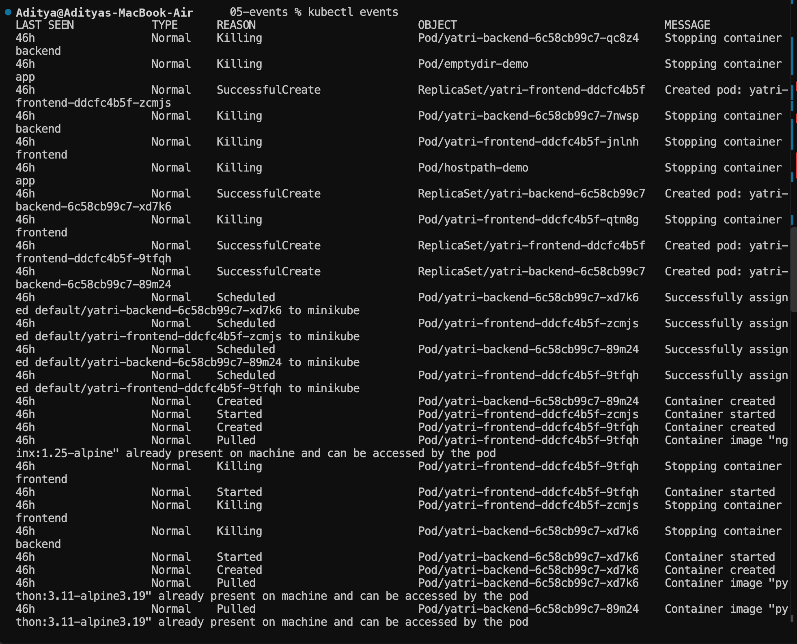

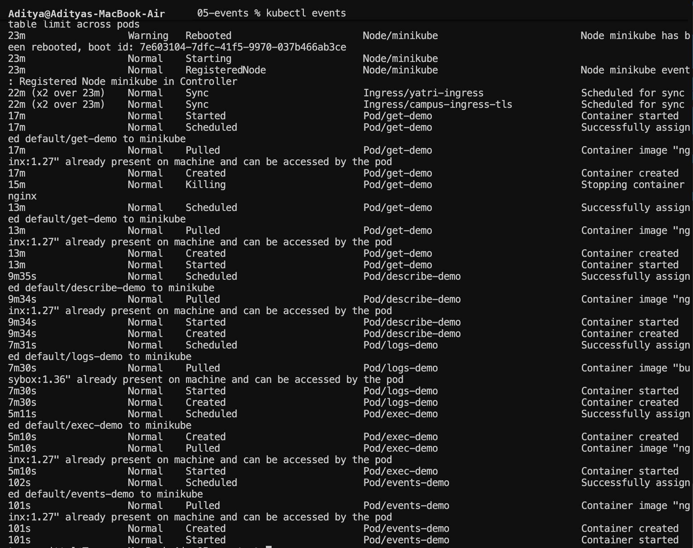

---

# 7. Watching Events

Events can be monitored continuously:

```bash
kubectl events --watch
```

This is useful while creating, restarting, scheduling, or troubleshooting workloads.

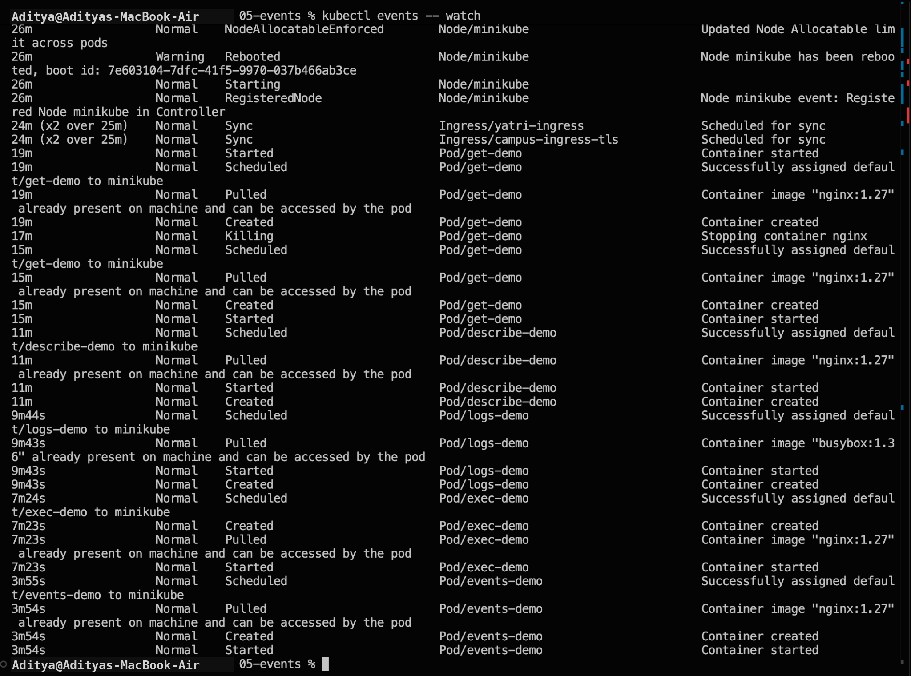

---

# 8. Sorting Events

Events can be sorted by their last timestamp:

```bash
kubectl get events --sort-by=.lastTimestamp
```

The correct option is `--sort-by`, not `--sortby`.

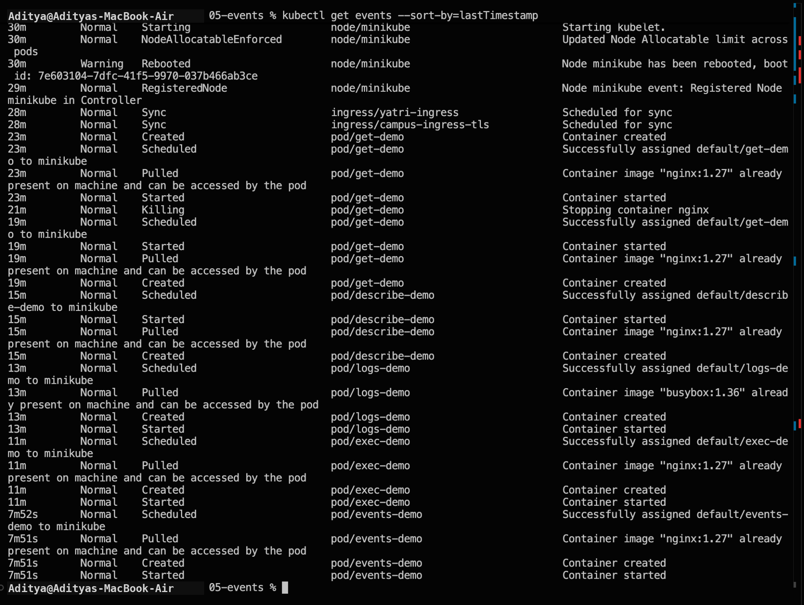

---

# 9. Events vs Logs

| Events | Logs |
|---|---|
| Kubernetes-level activity | Container/application output |
| Generated by Kubernetes | Produced by the application/container |
| Useful for lifecycle and scheduling information | Useful for runtime debugging |
| Can show scheduling, pulling, creation, startup, termination, and warnings | Can show application messages and errors |
| `kubectl events` | `kubectl logs <pod-name>` |

### Simple rule

**Events tell you what Kubernetes did.**

**Logs tell you what the container/application produced.**

A strong troubleshooting combination is:

```bash
kubectl describe pod <pod-name>
kubectl logs <pod-name>
kubectl events
```

---

# 10. CrashLoopBackOff / Container Crash Troubleshooting

The `06-crashloopbackoff` exercise intentionally created a container that exited with an error.

### Create and inspect

```bash
kubectl apply -f broken-pod.yaml
kubectl get pods
kubectl logs pod/crash-demo
```

The container produced an error and Kubernetes restarted it, resulting in crash/restart behavior.

### Why `apply` may fail when fixing a standalone Pod

A standalone Pod has several immutable specification fields. Therefore, attempting to change certain fields of an existing Pod can be rejected by Kubernetes.

### Correct approach

```bash
kubectl delete pod/crash-demo
kubectl apply -f fixed-pod.yaml
kubectl get pods
```

The corrected Pod reached:

```text
1/1 Running
```

For production workloads, Deployments are normally preferred because the Pod template can be updated and Kubernetes can create replacement Pods automatically.

---

# 11. ImagePullBackOff / ErrImagePull

The `07-imagepullbackoff` exercise used an invalid or unavailable image.

```bash
kubectl apply -f broken-pod.yaml
kubectl get pods
```

The Pod entered:

```text
ErrImagePull
```

Repeated failures can transition to:

```text
ImagePullBackOff
```

### Fix

Delete the broken Pod and apply the corrected manifest:

```bash
kubectl delete pod/image-demo
kubectl apply -f fixed-pod.yaml
kubectl get pods
kubectl logs image-demo
```

The corrected Pod reached:

```text
1/1 Running
```

Common causes of image-pull failures include:

- Incorrect image name
- Incorrect image tag
- Image does not exist in the registry
- Private registry authentication problems
- Registry or network access problems

---

# 12. Pending Pod Troubleshooting

The `08-pending-pods` exercise created a Pod that remained in:

```text
Pending
```

Possible causes include:

- No suitable node
- Insufficient resources
- Scheduling constraints
- Missing or unbound storage
- Taints/tolerations mismatch
- Other scheduling requirements

### Investigation

```bash
kubectl get pods
kubectl describe pod pending-demo
```

The Events section of `describe` is particularly useful for finding the scheduling reason.

### Fix

```bash
kubectl delete pod/pending-demo
kubectl apply -f fixed-pod.yaml
kubectl get pods
```

The corrected Pod reached:

```text
1/1 Running
```

---

# 13. Service and DNS Troubleshooting

The `09-service-dns-troubleshooting` exercise demonstrated how a Service provides stable access to backend Pods.

### Create the resources

```bash
kubectl apply -f deployment.yaml
kubectl apply -f service.yaml
kubectl apply -f dns-test-pod.yaml
```

Then inspect them:

```bash
kubectl get pods
kubectl get all
kubectl get svc
```

The `web` Deployment created two Pods and `web-service` exposed them as a ClusterIP Service.

### Check endpoints

```bash
kubectl get endpoints web-service
```

The working Service showed backend Pod addresses similar to:

```text
10.244.0.16:80,10.244.0.17:80
```

This confirms that the Service selector matched the Pods.

---

# 14. Broken Service and Empty Endpoints

A deliberately broken Service was created:

```bash
kubectl apply -f broken-service.yaml
kubectl get svc
kubectl get endpoints broken-service
```

The broken state showed:

```text
broken-service   <none>
```

`<none>` means that the Service currently has no matching backend endpoints.

A common cause is a mismatch between the Service selector and the Pod labels.

### Troubleshooting sequence

```bash
kubectl get svc
kubectl get pods --show-labels
kubectl get endpoints <service-name>
kubectl describe svc <service-name>
```

The relationship is:

```text
Service
   ↓
Selector
   ↓
Matching Pod labels
   ↓
Endpoints / EndpointSlices
   ↓
Backend Pods
```

---

# 15. Endpoints and EndpointSlice

The session also showed the Kubernetes warning:

```text
Warning: v1 Endpoints is deprecated in v1.33+;
use discovery.k8s.io/v1 EndpointSlice
```

The older `Endpoints` API is deprecated in newer Kubernetes versions. For modern inspection, use EndpointSlices:

```bash
kubectl get endpointslices
```

The core troubleshooting relationship remains:

```text
Service → selector → matching Pods → backend endpoints
```

---

# 16. Mini Project — Kubernetes Troubleshooting

The mini-project demonstrates a complete troubleshooting workflow using an Nginx Deployment, a ClusterIP Service, and an intentionally broken Pod.

## Troubleshooting workflow

```text
Deploy
  ↓
Observe
  ↓
Break
  ↓
Investigate
  ↓
Find Root Cause
  ↓
Fix
  ↓
Verify
```

## Project files

```text
mini-project/
├── deployment.yaml
├── service.yaml
├── broken-pod.yaml
├── README.md
└── images/
    ├── 01-deployment-and-pods.png
    ├── 02-broken-pod-and-service-endpoints.png
    ├── 03-pod-exec-and-service-describe.png
    └── 04-troubleshooting-and-service-fix.png
```

### 16.1 Deployment and Pods

The Deployment was applied and the resulting Pods were checked.

```bash
kubectl apply -f deployment.yaml
kubectl get pods
```

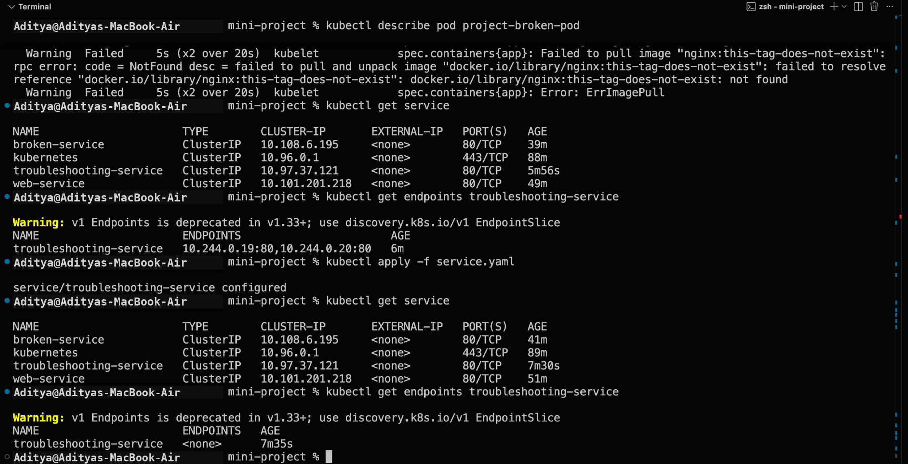

### 16.2 Broken Pod and Service Endpoints

The Service and endpoint state were investigated, including the broken workload scenario.

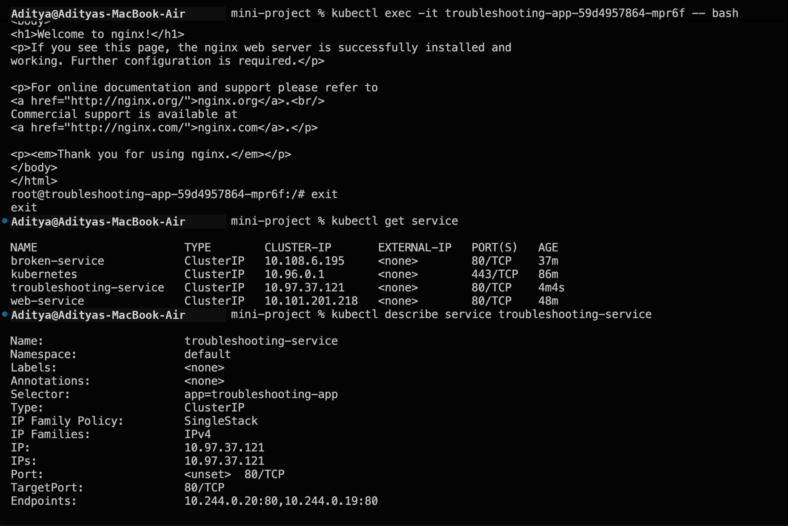

### 16.3 Pod Exec and Service Description

A running Pod was accessed and the Service configuration was inspected.

```bash
kubectl exec -it <pod-name> -- bash
kubectl describe service troubleshooting-service
```

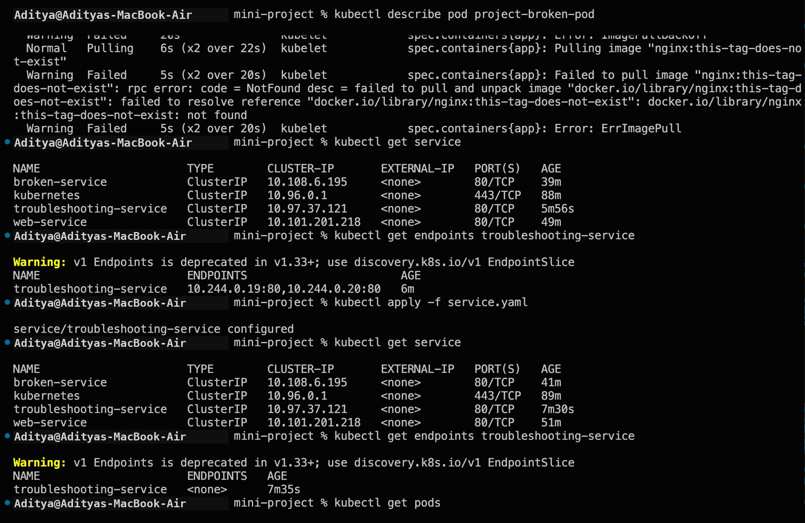

### 16.4 Troubleshooting and Service Fix

The broken configuration was identified, corrected, and verified.

```bash
kubectl apply -f service.yaml
kubectl get endpoints troubleshooting-service
```

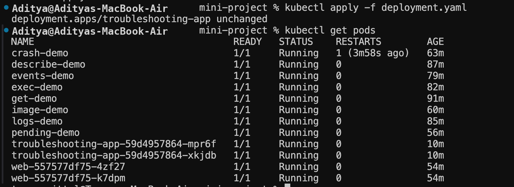

---

# 17. Broken Pod Root Cause

The intentionally broken Pod used:

```yaml
image: nginx:this-tag-does-not-exist
```

The root cause was confirmed with:

```bash
kubectl describe pod project-broken-pod
```

The Events section reported an image-pull failure similar to:

```text
Failed to pull image "nginx:this-tag-does-not-exist"
Error: ErrImagePull
```

### Fix

Replace the invalid image with a valid image, for example:

```yaml
image: nginx:1.27
```

Then recreate or update the appropriate workload and verify it reaches `Running`.

---

# 18. Troubleshooting Table

| Problem | What I Saw | Command | Root Cause | Fix |
|---|---|---|---|---|
| Container crash | Restarting / CrashLoopBackOff | `kubectl logs` / `kubectl describe` | Container command exits with an error | Correct the command and recreate/update the workload |
| Image problem | `ErrImagePull` / `ImagePullBackOff` | `kubectl describe pod` | Invalid or unavailable image | Use a valid image/tag |
| Pending Pod | `Pending` | `kubectl describe pod` | Scheduling/resource constraint | Fix scheduling/resource issue |
| Service problem | `<none>` endpoints | `kubectl get endpoints` | Selector does not match Pod labels | Correct the selector/labels |
| Endpoint API warning | Endpoints deprecation warning | `kubectl get endpointslices` | Older Endpoints API | Use EndpointSlice for modern inspection |

---

# 19. Important Troubleshooting Commands

### Pods

```bash
kubectl get pods
kubectl get pods -o wide
kubectl get pods -w
kubectl describe pod <pod-name>
kubectl logs <pod-name>
kubectl exec -it <pod-name> -- bash
kubectl cp <pod-name>:<path> <local-path>
```

### Events

```bash
kubectl events
kubectl events --watch
kubectl get events --sort-by=.lastTimestamp
```

### Services

```bash
kubectl get service
kubectl describe service <service-name>
kubectl get endpoints <service-name>
kubectl get endpointslices
```

### Labels

```bash
kubectl get pods --show-labels
```

---

# 20. Troubleshooting Questions

### 1. What does `kubectl get` tell us?

It provides a quick overview of Kubernetes resources and their current status.

### 2. What is the difference between `get` and `describe`?

`get` provides a concise summary, while `describe` provides detailed configuration, status, and Event information.

### 3. Why do we use `kubectl logs`?

To inspect output produced by the container and identify application-level problems.

### 4. When would you use `kubectl exec`?

When direct interaction with a running container is required, such as checking files, commands, networking, or application responses.

### 5. What does `CrashLoopBackOff` mean?

The container is repeatedly failing and Kubernetes is progressively increasing the delay before restarting it.

### 6. What does `ImagePullBackOff` mean?

Kubernetes could not pull the requested image and is backing off before retrying.

### 7. Why can a Pod remain `Pending`?

Kubernetes cannot successfully schedule it, often because of resource limits, node constraints, storage, or other scheduling requirements.

### 8. Why can a Service have no endpoints?

Usually because the Service selector does not match the labels on any healthy Pods.

### 9. What is the relationship between Service selectors and Pod labels?

The Service selector identifies which Pods become backend endpoints. The selector must match the relevant Pod labels.

### 10. What is Kubernetes DNS?

Kubernetes DNS allows applications inside the cluster to discover Services by DNS name rather than relying on manually configured Service IP addresses.

---

# 21. Final Troubleshooting Mindset

When something breaks, do not guess. Collect evidence first.

```text
GET
 ↓
DESCRIBE
 ↓
EVENTS
 ↓
LOGS
 ↓
EXEC
 ↓
TEST
 ↓
FIX
 ↓
VERIFY
```

This workflow makes Kubernetes troubleshooting systematic: observe the resource, collect evidence, identify the root cause, apply the smallest appropriate fix, and verify the result.

---

# Screenshot Index

All screenshots are stored under the repository's `images/` directory.

```text
images/
├── AllPods.png
├── kubectl-get.png
├── kubectl-logs.png
├── kubectl-events-1.png
├── kubectl-events-2.png
├── kubectl-events-watch.png
├── kubectl-events-sorted.png
├── 01-deployment-and-pods.png
├── 02-broken-pod-and-service-endpoints.png
├── 03-pod-exec-and-service-describe.png
└── 04-troubleshooting-and-service-fix.png
```

All image references in this README point to these local relative paths.

---

## Author

**Tanmay Mittal**  
Scaler School of Technology
